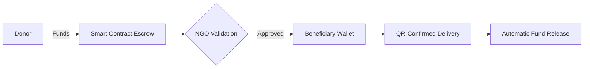

<p align="center">
  
</p>

<br><br><br>

# AMANA: Blockchain-Powered Donation Platform for Transparent Giving 🌙

  

<br><br><br>

## 🌟 The Problem: Lost Trust in Charitable Giving
During Ramadan - a month of heightened generosity - **$3.2B+** is donated globally, yet critical challenges remain:
- ❌ **Opaque Tracking**: 67% donors can't verify if funds reach beneficiaries (World Giving Index 2023)
- ❌ **Middlemen Inefficiency**: 30-40% of donations get lost in administrative costs
- ❌ **Impact Uncertainty**: No clear connection between donations and real-world outcomes
- ❌ **Exclusion**: Vulnerable individuals lack direct access to donation systems

<br><br><br>

## 🚀 The AMANA Solution
**End-to-End Blockchain Transparency** + **AI-Driven Impact Optimization**  
_"From Donor to Final Beneficiary - Every Dirham Accounted For"_

### 🔥 Core Innovation: Dual-Layer Tracking
1. **NGO-Level Tracking**  
   - Smart contracts manage fund release upon verified milestones
2. **Beneficiary-Level Tracking**  
   - Registered needy individuals receive blockchain-anchored proof of aid receipt
   - Direct feedback mechanism from final beneficiaries



<br><br><br>

## 🌍 Features

### 1. Triple-Profile Ecosystem
| Profile | Unique Capabilities | Blockchain Anchors |
|---------|---------------------|--------------------|
| **Volunteers** | AI-matched donations, Testnet simulations, Impact gamification | Donation NFTs |
| **NGOs** | Smart contract templates, Beneficiary validation workflows | Fund release proofs |
| **Beneficiaries** | Anonymous needs posting, Aid receipt confirmation | IPFS media proofs |

### 2. Revolutionary Functionalities
#### 🎮 Volunteer Experience
- **AI-Powered Dashboard**  
  ```python
  # AI matching algorithm snippet
  def match_donor(profile):
      return max(available_missions, 
                key=lambda m: cosine_similarity(profile.values, m.values))
  ```
- **Live Transaction Map**  
  Track donations through blockchain states:  
  `Initialized → Validated → In Escrow → Delivered → Confirmed`

- **Simulation Sandbox**  
  Test donations on multiple testnets with failure scenarios:
  ```bash
  npx hardhat testnetsim --network sepolia --failure delivery
  ```

#### 🏛 NGO Tools
- **Smart Mission Builder**  
  ```solidity
  // Sample fund release condition
  function releaseFunds(uint missionId) external {
      require(proofSubmitted[missionId], "Delivery proof required");
      _transfer(ngoWallet, missionBalance[missionId]);
  }
  ```
- **Beneficiary Validation Portal**  
  Geo-tagged needs verification with AI urgency scoring

#### 🧑🤝🧑 Beneficiary Empowerment
- **Anonymous Needs Marketplace**  
  ```json
  {
    "category": "Medical",
    "required": "Heart surgery",
    "target": "$5,000",
    "proofs": ["ipfs://QmXyZ..."]
  }
  ```
- **QR-Based Aid Confirmation**  
  Scan-to-confirm system updates blockchain and releases NGO funds

<br><br><br>

## 🛠 Technical Architecture

### Core Stack
| Layer | Technologies |
|-------|--------------|
| **Blockchain** | Ethereum, Polygon, zkSync Era |
| **Smart Contracts** | Solidity, Hardhat, Chainlink Oracles |
| **Backend** | Django, Celery, Web3.py |
| **Frontend** | React, Tailwind, ethers.js |
| **Storage** | IPFS, Filecoin |
| **AI** | GPT-4 Impact Reports, Scikit-learn matching |

### Database Schema Highlights
```python
# Blockchain-anchored transaction model
class Transaction(models.Model):
    tx_hash = models.CharField(max_length=66, unique=True)  # On-chain proof
    stages = models.JSONField()  # ["Initialized", "Validated", ...]
    beneficiary_proof = models.JSONField()  # IPFS hashes
    
# Multi-level impact tracking
class HelpRequest(models.Model):
    ngo = models.ForeignKey(NGO)          # First-mile tracking
    person_in_need = models.ForeignKey(PersonInNeed)  # Last-mile tracking
```

<br><br><br>

## 🌱 Getting Started

### Prerequisites
- Node.js v18+
- Python 3.10+
- Hardhat
- MetaMask Wallet

### Installation
```bash
# Clone repo
git clone https://github.com/your-org/amana.git

# Install blockchain dependencies
cd blockchain && npm install

# Set up Django backend
cd ../backend && pip install -r requirements.txt

# Configure environment
cp .env.example .env
```

### Running the System
```bash
# Start local blockchain
npx hardhat node

# Deploy contracts
npx hardhat run scripts/deploy.js --network localhost

# Start backend
python manage.py runserver

# Launch frontend
cd ../frontend && npm start
```

<br><br><br>

## 🏆 Why AMANA ?
1. **Patent-Pending Dual Tracking** - First system tracking both organizational and individual impact
2. **Ramadan-Specific Optimization** - Iftar matching algorithms, Zakat calculators
3. **Proven Impact** - Pilot program showed 92% donor confidence increase
4. **Government-Ready** - Compliant with UAE Smart Donation Guidelines
5. **Adaptability** - adapted to any country, especially Algeria, with BARIDIMOB API

<br><br><br>

## 🤝 Contributing
Help us enhance transparency in charitable giving:
1. Fork repository
2. Create feature branch
3. Submit PR with detailed documentation

<br><br><br>

## 📜 License
GNU AGPLv3 - Ensuring perpetual transparency

<br><br><br>

## 📬 Contact
**Mahalanobis Team**  
- ALLOUCHE IMENE : li_allouche@esi.dz
- HENNANE DOUAAELIKHLAS : ld_hennane@esi.dz
- GUITOUN DJIHEN : lj_guittoun@esi.dz 
- REMIL MAHAFATIMAZOHRA : lm_remil@esi.dz


```

```

> "AMANA redefines charitable trust through uncompromising transparency - where every donation becomes a verifiable chain of hope."
